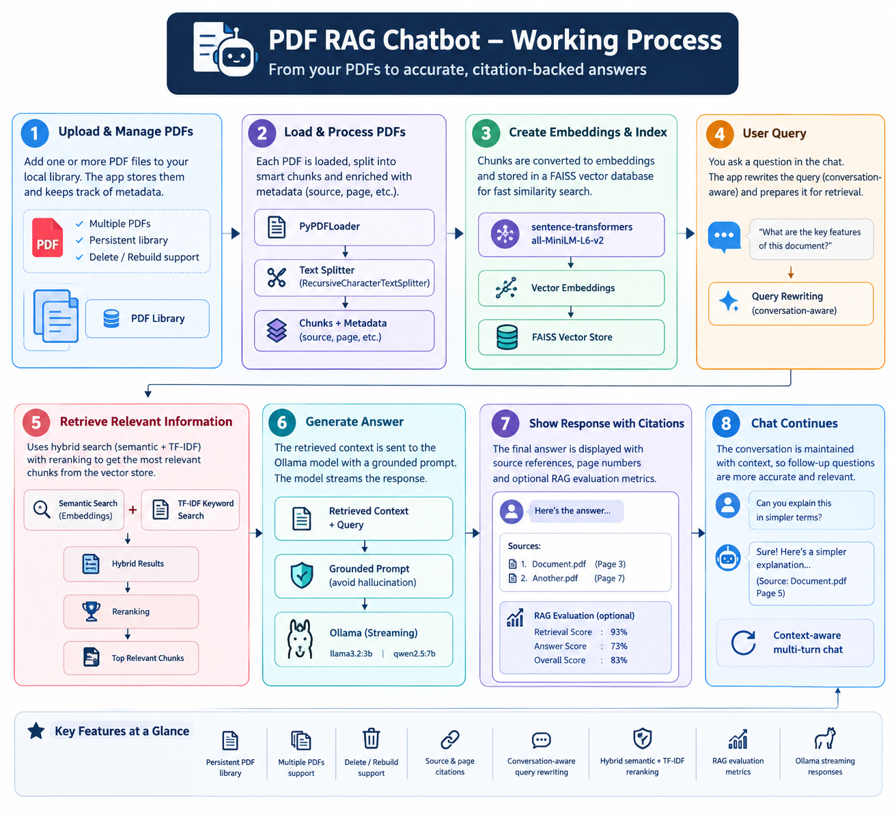

# Local PDF RAG Chatbot

> A privacy-focused, local Retrieval-Augmented Generation (RAG) chatbot for asking questions about PDF documents using hybrid retrieval and a local LLM.

## Overview

The **Local PDF RAG Chatbot** is an end-to-end Retrieval-Augmented Generation application built with Python, Streamlit, LangChain, FAISS, Hugging Face embeddings, scikit-learn, and Ollama.

The application allows users to upload PDF documents, process them locally, retrieve relevant information, and generate answers grounded in the uploaded documents.

The system is designed to run locally without requiring an external LLM API.

---

## Working Process

The following diagram illustrates the complete end-to-end workflow of the PDF RAG Chatbot, from PDF ingestion and embedding creation to hybrid retrieval, local LLM generation, source citations, and context-aware conversations.

<p align="center">
  
</p>

## Architecture

```text
                         ┌─────────────────────┐
                         │       User          │
                         │     Streamlit       │
                         └──────────┬──────────┘
                                    │
                                    ▼
                         ┌─────────────────────┐
                         │     PDF Upload      │
                         └──────────┬──────────┘
                                    │
                                    ▼
                         ┌─────────────────────┐
                         │   PDF Text Loading  │
                         │    PyPDFLoader      │
                         └──────────┬──────────┘
                                    │
                                    ▼
                         ┌─────────────────────┐
                         │    Text Chunking    │
                         │ Recursive Splitter  │
                         └──────────┬──────────┘
                                    │
                                    ▼
                    ┌──────────────────────────────┐
                    │     Hugging Face Embeddings │
                    │     all-MiniLM-L6-v2        │
                    └──────────────┬───────────────┘
                                   │
                                   ▼
                         ┌─────────────────────┐
                         │     FAISS Vector    │
                         │      Database       │
                         └──────────┬──────────┘
                                    │
                              User Question
                                    │
                                    ▼
                         ┌─────────────────────┐
                         │   Query Processing  │
                         │ + Query Rewriting   │
                         └──────────┬──────────┘
                                    │
                                    ▼
              ┌────────────────────────────────────────┐
              │           Hybrid Retrieval             │
              │                                        │
              │  Semantic Search                       │
              │  TF-IDF Search                         │
              │  Token Coverage                        │
              │  Phrase Matching                       │
              └───────────────────┬────────────────────┘
                                  │
                                  ▼
                         ┌─────────────────────┐
                         │ Candidate Reranking │
                         │ + Diversity Filter  │
                         └──────────┬──────────┘
                                    │
                                    ▼
                         ┌─────────────────────┐
                         │ Relevant PDF Context│
                         └──────────┬──────────┘
                                    │
                                    ▼
                         ┌─────────────────────┐
                         │  Ollama Llama 3.2   │
                         │     Local LLM       │
                         └──────────┬──────────┘
                                    │
                                    ▼
                         ┌─────────────────────┐
                         │  Grounded Answer    │
                         │ + Sources + Pages   │
                         └─────────────────────┘
   # Key Features
                         RAG Pipeline
Hybrid Retrieval
Conversational Retrieval
Local LLM
Source Attribution
PDF Page Viewer
Chat Management
Performance Monitoring
Project Structure
Technology Stack
Installation
Running the Application
Basic Usage
Configuration
Privacy & Local-First Design
GitHub Repository Hygiene
Limitations
Future Improvements
Engineering Highlights
Application Workflow
Project Status
Author
License